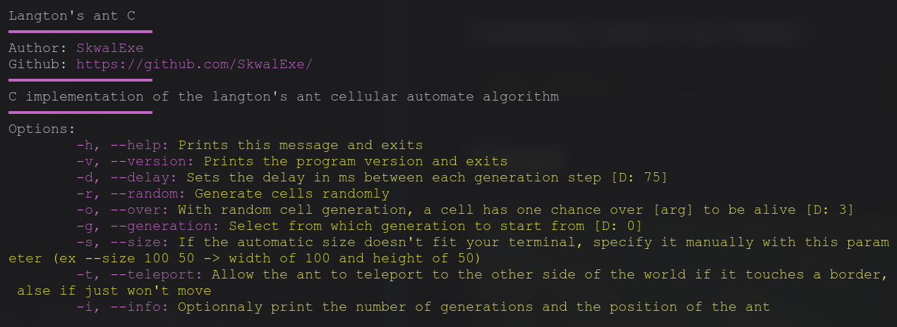
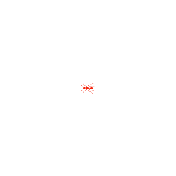
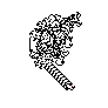

# Langton's Ant cellular automaton simulator

This program is a terminal application made in C that simulates the langton's ant cellular automaton.

# Installation 📦

## Build 🛠️

```bash
make
```

## Installation (add to bin folder)

```bash
make install
```

# Usage



# What is a Cellular Automaton
- A grid of cells that can have **two or more states** (e.g. Living or Dead)
- The grid's state changes during each generation depending on **certain rules**
- Cellular automata fascinates researchers because of the **very complex behaviours** that can emerge from **very simple rules**
  
# Langton's Ant rules

The rules of the Langton's ant cellular automaton are the following:

- The ant starts in the middle of the grid
- The ant can move in four directions: up, down, left and right
- If the ant is on a white square, it turns 90º clockwise and moves forward
- If the ant is on a black square, it turns 90º counterclockwise and moves forward



# Very complex behaviour

When we simulate the Langton's Ant, we can observe the following behaviours:

- During the first few hundreds generations, the ant creates a symmetric pattern
- After a while, the ant starts to create irregular patterns, chaos
- Around the 10.000th generation, the ant starts to create a regular "highway" pattern



The very complex behaviour that can emerge from this cellular automaton is that no matter where the ant starts, and the state of the grid, the ant will always end up in the same "highway" pattern.

This behaviour even happens when we change the rules of the cellular automaton, the ant will still end up in the same "highway" pattern.

# Structure of the project

## `src/main.c`

This file manages argument parsing, and is used for starting the simulation

## `src/utils.c`

This file contains usefull fonctions such as `sleep_ms`, `clear_terminal` and more so that the `main.c` file is not too long

## `src/langton.c`

This file contains all the logic of the cellular automaton

# Uninstall

```bash
# 📂 langton-ant-c
make uninstall
# This will just delete /usr/bin/langton
```

# final

If you have any problem, dont hesitate to open an issue.

# contributing

Pull requests are welcome. For major changes, please open an issue first to discuss what you would like to change.